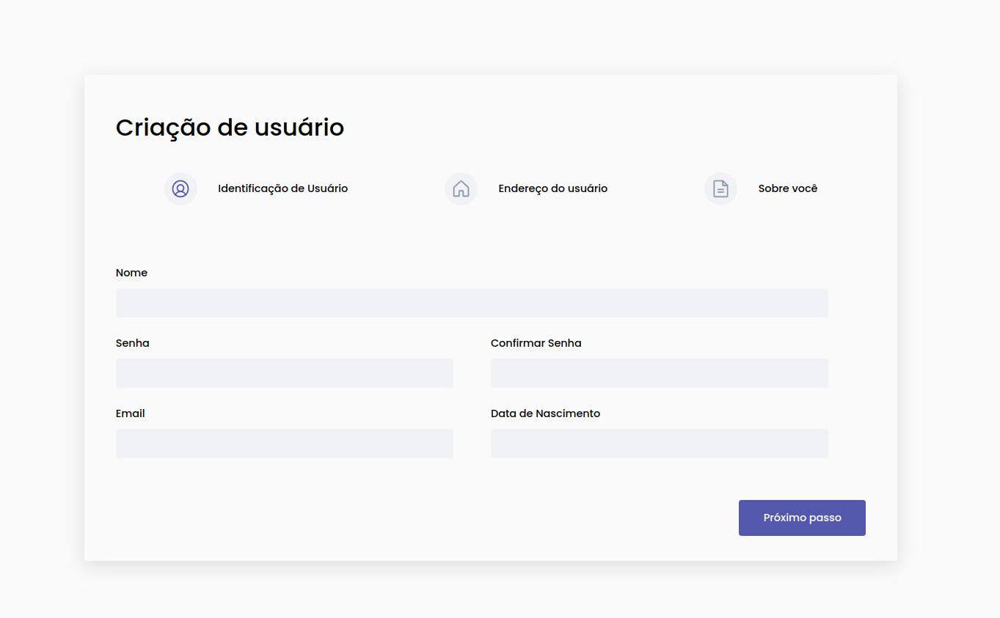
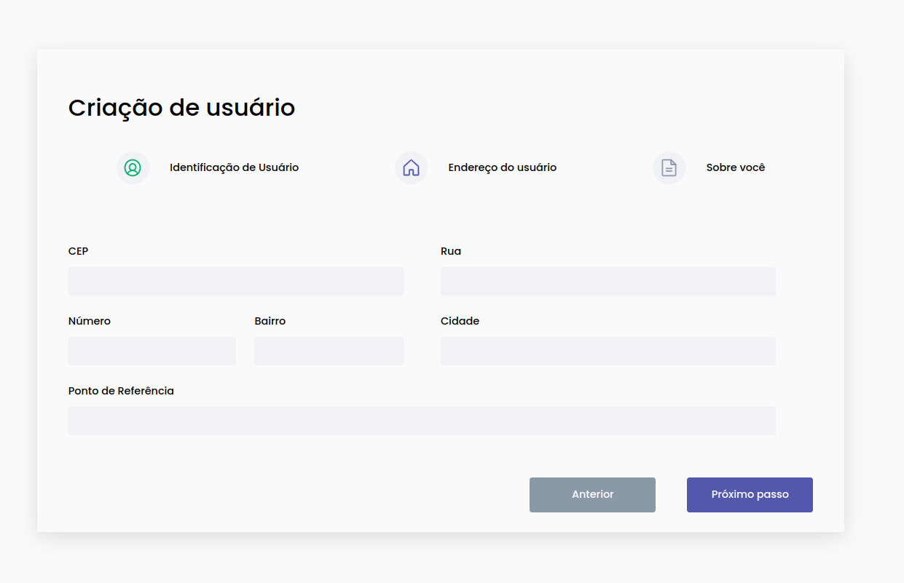
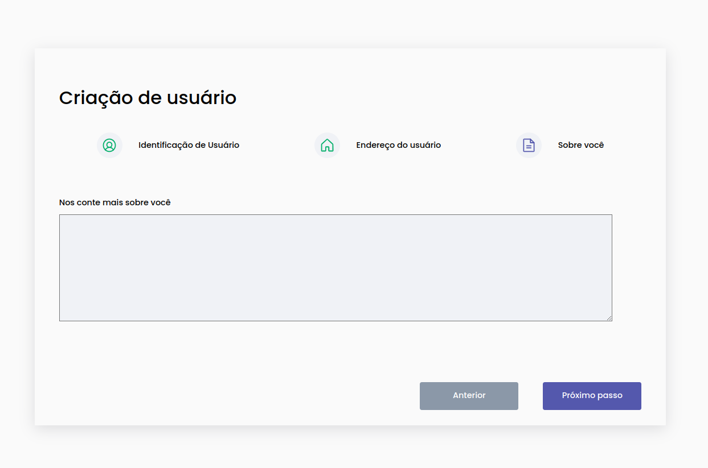
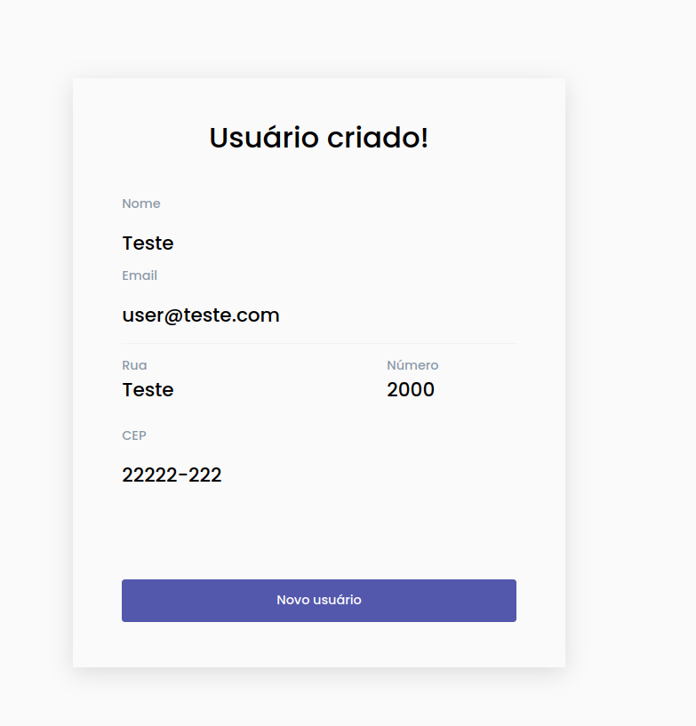

# Desafio Front-end Sossego 

Projeto de implementação de uma aplicação de formulários com etapas (multi-step) realizando as devidas validações e reproduzindo o layout fornecido.

## Requisitos

A aplicação precisa ser desenvolvida em ReactJs
Todas as informações de formulário deverão ser armazenadas em um contexto para a exibição como mostrado na última tela
A biblioteca para estilização é de livre escolha
Todos os campos deverão possuir validações.
O teste deverá ser entregue com o link para o repositório do Github

## Layout Final

  
  

  
  

## Instalação

1. Clone o repositório `git@github.com:gabrieldezena10/PS-Sossego.git`

2. Instale os pacotes do projeto `npm install`

3. Execute `npm run dev` e acesse `http://localhost:5173` para visualizar a aplicação

	
## Tecnologias

- [React.js](https://pt-br.reactjs.org/)
- [React Context](https://reactjs.org/docs/context.html)
- [React Hook Form](https://react-hook-form.com/)
- [Styled Components](https://styled-components.com/)
- [Phosphor Icons](https://phosphoricons.com/)

## Autor

Criado por [Gabriel Dezena](https://github.com/gabrieldezena10).

Me encontre no [LinkedIn](https://www.linkedin.com/in/gabriel-dezena/)!

Cheers! 🍻

    <a href="#">Voltar ao topo</a>

